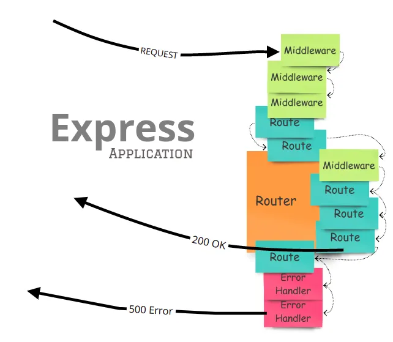

<p align="center">
  <a href="" rel="noopener">
 </a>
</p>
<h1 align="center">Express Middleware</h1>


<p align="center"> Getting Started with Express Middleware.
    <br> 
</p>

## 📝 Table of Contents

- [What is Middleware in Express js.](#🧐-what-is-middleware)
- [Create Middleware](#💡-create-middleware)
- [Use Middleware](#limitations)
- [Custom Middleware](#🚀-custom-middleware)
- [Project Structure with Middlewares](#🏁-project-structure-with-middlewares)
- [Handling Errors With Middleware](#🎈-handling-errors-with-middleware)
- [Use Multiple Middleware](#⛏️-use-multiple-middleware)
- [Resources](#resources)
- [Authors](#authors)


---

## 🧐 What is Middleware <a name = "problem_statement"></a>

Middleware functions are functions that have access to the request object (req), the response object (res), and the next middleware function in the application’s request-response cycle.
The next middleware function is commonly denoted by a variable named next [Express Docs](https://expressjs.com/en/guide/using-middleware.html).

## 💡 Create Middleware <a name = "idea"></a>

Since Middleware is a function, so it can be created by define a function, or like an arrow function variabe.

This function accept the main `request` and `response` arguments, and also `next` argument to be used as a callback, to move the process to next handler.

Example to define a new Middleware:
```javascript
import express from 'express';

const app = express();

const myNewMiddleware = (req, res, next)=>{
  // some processing ....
  // ...
  // proceed to next handler
  next()
}
```

==Important==: Don't use the middleware before initialize it in case `arrow Function`.


Example to define a new Middleware as a function:
```javascript
import express from 'express';

const app = express();

function myNewMiddleware(req, res, next){
  // some processing ....
  // ...
  // proceed to next handler
  next()
}
```

---

## ⛓️ Use Middleware <a name = "limitations"></a>

To use the Middleware, just call it before the last handler.
```javascript
import express from 'express';

const app = express();

function myNewMiddleware(req, res, next){
  // some processing ....
  // ...
  // proceed to next handler
  next()
}

app.get("/some_route", myNewMiddleware, (req, res)=>{
  res.send("RESPONSE")
})
```
---

## 🚀 Custom Middleware <a name = "future_scope"></a>

Lets write a new Custom Middleware, to log in terminal the request url:

```javascript
import express from 'express';

const app = express();

const logURL = (req, res, next){
  // Logging Request URL...
  console.log(`Request URL: ${req.url}`);
  next();
}

// use this middleware in some specific route:
app.get('/', logURL, (req, res)=>{
  res.send("WHATEVER");
});
```
So this `logURL` middleware, will work only for incomming request to '`/`' path.

To make this Middleware work for all requests, then we can use it in the beginning of all routes, like This:

```javascript
import express from 'express';

const app = express();

const logURL = (req, res, next){
  // Logging Request URL...
  console.log(`Request URL: ${req.url}`);
  next();
}

// use this middleware in any/all routes:
app.use(logURL);

```
---

## 🏁 Project Structure with Middlewares <a name = "getting_started"></a>

To Organize the project, usualy all middleware functions will be in an external file, in `middleware` folder at the root of the project, so it can easly improved and easy to debug.

So that the project Structure will be like this:

```bash
.
├── middleware
│   ├── checkName.js
│   └── logInfo.js
├── routes
│   ├── mainRouter.js
│   └── searchRouter.js
├── app.js
├── package.json
├── package-lock.json
└── README.md
```

Then, we can import any middleware and use it in any route. 

---

## 🎈 Handling Errors With Middleware <a name="usage"></a>

Simply we can handle the errors in middleware and make some process, by ==NOT USING NEXT== callback if there is an error on request or in server, so we can make `if condition` inside the middleware, if some condition thate represents error, so we dont use `next()`, or we can use `next` and pass inside it a new `Error` object, or just a small string describe that error on production mode.

Here is an example:

```javascript
const validateRequest = (req, res, next)=>{
  // error in case if the request dosn't contains `q` in query:
  if(req.query.q){
    // OK, proceed to next Handler
    next();
  }else{
    // NOT OK, show an error:
    next(new Error("The request dosn't conteins a keyword to search"))
  }
}
```

So in this case, the request will not reach to next handler, the error will arrive to `express` and be logged in terminal, sametime will be sent to the client.

## ⛏️ Use Multiple Middleware <a name = "tech_stack"></a>

We can use a lot of middleware in some specific or all routes, by calling them side by side before the end handler:

```javascript

app.get('/some_path', middleWare_1, middleWare_2, middleWare_3, (req, res)=>{
  // ...
})
```

Also an array of middleware can be used, like this example:

```javascript
app.get('/some_path', [middleWare_1, middleWare_2, middleWare_3], (req, res)=>{
  // ...
})
```
---

## Resources

**[Express Documentation](https://expressjs.com/en/guide/using-middleware.html)**

## ✍️ Authors <a name = "authors"></a>

- [Mostafa Othman](https://github.com/mostafa-dci).

