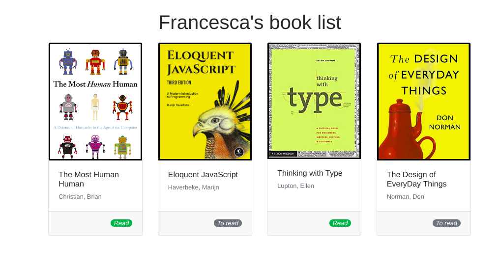
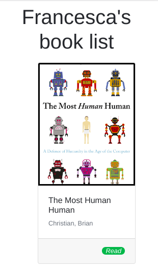

# The Book List

Create a personalized book website! Instead of adding all of the details of books in HTML, add data on the page from the `books` array in `index.js` using JavaScript.

## Book Details
Display the book details on the page, such as author's name, book title and reading status. The book cover should appear above the book details and the image should link to the URL of the book cover.

## Status
The styling of reading status should be updated depending on whether the book has been read - the bootstrap badge style should change as well as the text, which should appear as "Read".

## Order
The authors' last names should appear first e.g. "Smith, John". Furthermore, the books should be displayed on the page in alphabetical order according to the authors' last names.

**Images**:

**Notes**:
* Deadline: 2hrs.
* Work with the `index.html` and `index.js` files provided in this repository.
* Add bootstrap styling where necessary. See the reference images for result.

[//]: # (autograding info start)
## Results

### Task 1: Create a personalized book website 

|                 Status                  | Check                                                                                    |
| :-------------------------------------: | :--------------------------------------------------------------------------------------- |
|  | check books detiles not added directly to the HTML file |

### Task 2: get books detiles from `index.js` 

|                 Status                  | Check                                                                                    |
| :-------------------------------------: | :--------------------------------------------------------------------------------------- |
|  | check books detiles not added directly to the HTML file |
|  | Book detiles Displayd in the HTML file |
|  | The book image is above book detiles |
|  | Check Read status |

### Task 3: Order

|                 Status                  | Check                                                                                    |
| :-------------------------------------: | :--------------------------------------------------------------------------------------- |
|  | The authur lastname shuld be the first. |
|  | Check alphabetical sorting the Books according to the author names. |

### Task 4: check Bootstrap style link imported

|                 Status                  | Check                                                                                    |
| :-------------------------------------: | :--------------------------------------------------------------------------------------- |
|  | Check Bootstrap style link imported |

[🔬 Results Details](https://github.com/DigitalCareerInstitute/Browser-DOM-manipulating/actions)

[📢 Give Feedback or Report Problem](https://docs.google.com/forms/d/e/1FAIpQLSfS8wPh6bCMTLF2wmjiE5_UhPiOEnubEwwPLN_M8zTCjx5qbg/viewform?usp=pp_url&entry.652569746=Browser-DOM-manipulating&entry.2115011968=https%3A%2F%2Fgithub.com%2FDigitalCareerInstitute%2FBrowser-DOM-manipulating)

### Debugging your code
> [reading the test outputs](https://github.com/DCI-EdTech/autograding-setup/wiki/Reading-test-outputs)

There are two ways to see why tasks might not be completed:
#### 1. Running tests locally
- Run `npm install`
- Run `npm test` in the terminal. You will see where your solution differs from the expected result.

#### 2. Inspecting the test output on GitHub
- Go to the [Actions tab of your exercise repo](https://github.com/DigitalCareerInstitute/Browser-DOM-manipulating/actions)
- You will see a list of the test runs. Click on the topmost one.
- Click on 'Autograding'
- Expand the item 'Run DCI-EdTech/autograding-action@main'
- Here you see all outputs from the test run

[//]: # (autograding info end)